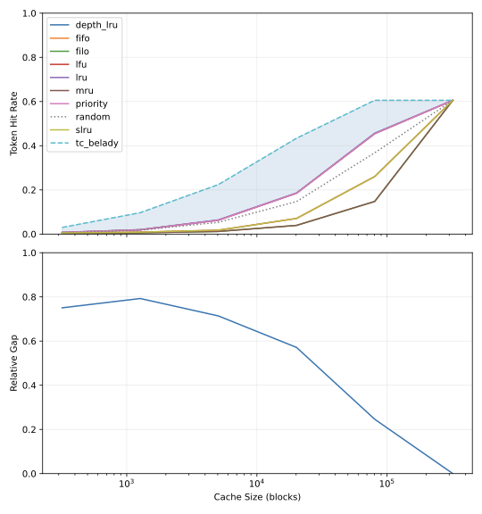
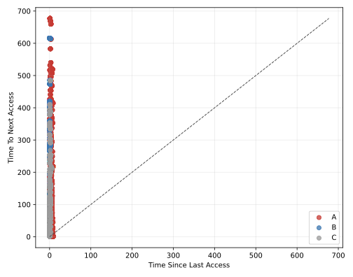

# Prefix Cache Belady Gap Analysis

LLM inference servers reuse cached key-value computations across requests by storing shared prompt prefixes in a radix-tree cache. This project measures how much performance existing eviction policies (LRU, LFU, FIFO, etc.) leave on the table compared to an offline oracle (tc_belady) under a fixed-block radix-tree model, using real ShareGPT conversation traces.

## Report

The current interactive report is hosted here:

https://superattention.github.io/llm-prefix-cache-analysis/report_site

## Figures



This figure shows token hit rate across cache budgets for each policy, plus the relative gap between `tc_belady` and the best non-oracle policy at each budget. It supports the benchmark-level observation that the online policies leave measurable headroom under this tree-constrained oracle, especially at mid-sized budgets. PDF: [`gap_curve.pdf`](./paper/figures/gap_curve.pdf)



This figure summarizes the shadow-oracle disagreement records for `lru` at the selected peak-gap cache size. Group `A` records are blocks LRU evicted but Belady kept; group `B` records are blocks Belady evicted but LRU kept. The group summaries indicate that `B` blocks are often recently touched, deep in the tree, and never reused, which is evidence for the "false-warm deep tail" failure mode in this trace. PDF: [`mechanism_scatter.pdf`](./paper/figures/mechanism_scatter.pdf)

## Repository layout

- [`src/`](./src) — cache model, eviction policies, simulator, metrics, oracle, mechanism analysis, and plotting code
- [`scripts/`](./scripts) — command-line pipeline stages
- [`tests/`](./tests) — unit tests for trace construction, simulation, paging, mechanism analysis, plotting, and report-site content
- `cache/` — default local output directory for generated traces, simulation results, and mechanism-analysis pickles (not required to exist before running the pipeline)
- `paper/figures/` — default output directory for generated plots from `scripts/04_plot.py`
- [`benchmark_results_llama_alt.md`](./benchmark_results_llama_alt.md) — current factual benchmark note

Eviction policies implemented: `lru`, `lfu`, `fifo`, `mru`, `filo`, `slru`, `priority`, `random`, `depth_lru`, and the tree-constrained offline oracle `tc_belady`.

## Current benchmark

- Dataset source: cached local snapshot of `anon8231489123/ShareGPT_Vicuna_unfiltered`
- Tokenizer: `NousResearch/Meta-Llama-3-8B-Alternate-Tokenizer`
- Conversations: `300`
- Accesses: `978`
- Ordering: interleaved, random with seed `0`
- Cache model: fixed-size block radix tree, capacity measured in blocks
- Default reported page size: `1` token per block

### Benchmark Snapshot

Trace: `300` ShareGPT conversations, `978` accesses, `811,050` requested tokens, `319,862` unique block prefixes.

Token hit rate (showing `tc_belady`, `lru`, `depth_lru`, and `random` as representative oracle, best, near-best, and baseline):

| strategy | 1271 blocks | 20160 blocks | 319862 blocks |
| --- | ---: | ---: | ---: |
| `tc_belady` | 0.0969 | 0.4339 | 0.6056 |
| `lru` | 0.0192 | 0.1850 | 0.6056 |
| `depth_lru` | 0.0201 | 0.1860 | 0.6056 |
| `random` | 0.0175 | 0.1472 | 0.6056 |

Peak relative gap for `lru` vs `tc_belady`: `80.2%` at `1271` blocks. At the `20160`-token budget, the absolute `lru` gap is `0.2488` token-hit-rate points. Full results are in [benchmark_results_llama_alt.md](./benchmark_results_llama_alt.md) and the generated CSV/Markdown sidecars.

## Result artifacts

Generated binary artifacts are written wherever the script `--output` argument points. The documented pipeline writes:

- Trace pickle: `cache/sharegpt-trace-300-llama-alt.pkl`
- Main benchmark results: `cache/sharegpt-results-300-llama-alt-benchmark.pkl`
- Mechanism analysis: `cache/sharegpt-mechanism-300-llama-alt.pkl`
- Generated figures: `paper/figures/gap_curve.pdf` and `paper/figures/mechanism_scatter.pdf`
- Simulation sidecars: `cache/sharegpt-results-300-llama-alt-benchmark.csv` and `cache/sharegpt-results-300-llama-alt-benchmark.md`
- Mechanism sidecars: `cache/sharegpt-mechanism-300-llama-alt-summary.csv` and `cache/sharegpt-mechanism-300-llama-alt-summary.md`

The reported numbers should remain the same when rerunning from the same `cache/sharegpt-trace-300-llama-alt.pkl`. Rebuilding the trace from Hugging Face can change if the upstream dataset file or tokenizer revision changes, so the trace pickle is the reproducibility boundary for the simulation and mechanism-analysis stages.

## Pipeline

Requires Python 3.10+. Install dependencies:

```bash
pip install -r requirements.txt
```

Prepare a tokenized trace:

```bash
python scripts/01_prepare_trace.py \
  --limit 300 \
  --order interleaved \
  --seed 0 \
  --dataset anon8231489123/ShareGPT_Vicuna_unfiltered \
  --tokenizer NousResearch/Meta-Llama-3-8B-Alternate-Tokenizer \
  --output cache/sharegpt-trace-300-llama-alt.pkl
```

> **Note:** `anon8231489123/ShareGPT_Vicuna_unfiltered` contains mixed file types and multiple JSON files, so `datasets.load_dataset()` cannot infer it directly. The trace-preparation helper falls back to the known benchmark file `ShareGPT_V3_unfiltered_cleaned_split.json`. On a fresh machine this may download a large Hugging Face file. For exact reproduction, prefer reusing the generated trace pickle or pass a local JSON snapshot:
>
> ```bash
> python scripts/01_prepare_trace.py \
>   --limit 300 \
>   --order interleaved \
>   --seed 0 \
>   --dataset /path/to/ShareGPT_V3_unfiltered_cleaned_split.json \
>   --tokenizer NousResearch/Meta-Llama-3-8B-Alternate-Tokenizer \
>   --output cache/sharegpt-trace-300-llama-alt.pkl
> ```

Run the main simulation sweep:

```bash
python scripts/02_simulate.py \
  --trace cache/sharegpt-trace-300-llama-alt.pkl \
  --output cache/sharegpt-results-300-llama-alt-benchmark.pkl \
  --page-size 1 \
  --strategies lru lfu fifo mru filo slru priority random tc_belady \
  --sizes 319 1271 5061 20160 80302 319862
```

Run mechanism analysis at the peak-gap cache size:

```bash
python scripts/03_mechanism.py \
  --results cache/sharegpt-results-300-llama-alt-benchmark.pkl \
  --trace cache/sharegpt-trace-300-llama-alt.pkl \
  --output cache/sharegpt-mechanism-300-llama-alt.pkl \
  --baseline lru \
  --page-size 1
```

Generate paper figures from result artifacts:

```bash
python scripts/04_plot.py \
  --results cache/sharegpt-results-300-llama-alt-benchmark.pkl \
  --mechanism cache/sharegpt-mechanism-300-llama-alt.pkl \
  --figures-dir paper/figures \
  --strategy lru
```

## Important modeling note

The current simulator is intentionally simplified relative to production SGLang:

- fixed-size block accounting
- leaf-block eviction
- no lock-state modeling
- no extra-key namespaces
- no Eagle/bigram mode

The goal is a clean, analyzable eviction study under a page-aligned radix model. `tc_belady` should be read as an upper bound under the same leaf-only candidate constraint, not as an unconstrained global optimum for production prefix caching.

## Tests

```bash
pytest
```

Run a focused test file while iterating:

```bash
pytest tests/test_simulate.py
```

Run an individual test by node id:

```bash
pytest tests/test_simulate.py::test_run_suite_reports_both_metrics_for_each_cache_size
```
